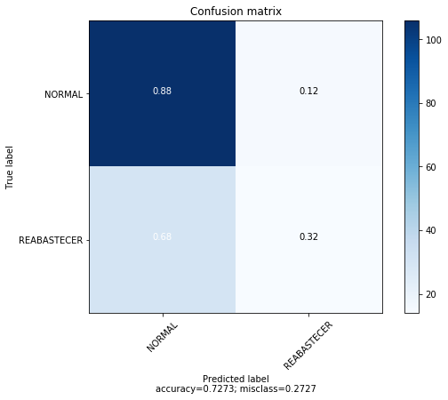

.. code:: ipython3

    # @hidden_cell
    # The project token is an authorization token that is used to access project resources like data sources, connections, and used by platform APIs.
    from project_lib import Project
    project = Project(project_id='b164f591-3528-4d6b-b378-858a239726a3', project_access_token='p-820d38bbaf9d851f5779ff3586fdf433b3185dc1')
    pc = project.project_context

.. code:: ipython3

    # Insira seu project token aqui

MARATONA BEHIND THE CODE 2020
=============================

DESAFIO 7 - TNT
---------------

.. raw:: html

   

Installing Libs
---------------

.. code:: ipython3

    !pip install scikit-learn --upgrade

.. parsed-literal::

    Collecting scikit-learn
    [?25l  Downloading https://files.pythonhosted.org/packages/5c/a1/273def87037a7fb010512bbc5901c31cfddfca8080bc63b42b26e3cc55b3/scikit_learn-0.23.2-cp36-cp36m-manylinux1_x86_64.whl (6.8MB)
         |████████████████████████████████| 6.8MB 9.8MB/s eta 0:00:01
    [?25hRequirement already satisfied, skipping upgrade: scipy>=0.19.1 in /opt/conda/envs/Python36/lib/python3.6/site-packages (from scikit-learn) (1.2.0)
    Collecting joblib>=0.11 (from scikit-learn)
    [?25l  Downloading https://files.pythonhosted.org/packages/51/dd/0e015051b4a27ec5a58b02ab774059f3289a94b0906f880a3f9507e74f38/joblib-0.16.0-py3-none-any.whl (300kB)
         |████████████████████████████████| 307kB 35.0MB/s eta 0:00:01
    [?25hRequirement already satisfied, skipping upgrade: numpy>=1.13.3 in /opt/conda/envs/Python36/lib/python3.6/site-packages (from scikit-learn) (1.15.4)
    Collecting threadpoolctl>=2.0.0 (from scikit-learn)
      Downloading https://files.pythonhosted.org/packages/f7/12/ec3f2e203afa394a149911729357aa48affc59c20e2c1c8297a60f33f133/threadpoolctl-2.1.0-py3-none-any.whl
    ERROR: autoai-libs 1.10.5 has requirement numpy>=1.16.4, but you'll have numpy 1.15.4 which is incompatible.
    ERROR: autoai-libs 1.10.5 has requirement pandas>=0.24.2, but you'll have pandas 0.24.1 which is incompatible.
    ERROR: autoai-libs 1.10.5 has requirement scikit-learn==0.20.3, but you'll have scikit-learn 0.23.2 which is incompatible.
    Installing collected packages: joblib, threadpoolctl, scikit-learn
      Found existing installation: scikit-learn 0.20.3
        Uninstalling scikit-learn-0.20.3:
          Successfully uninstalled scikit-learn-0.20.3
    Successfully installed joblib-0.16.0 scikit-learn-0.23.2 threadpoolctl-2.1.0

.. code:: ipython3

    !pip install xgboost --upgrade

.. parsed-literal::

    Collecting xgboost
    [?25l  Downloading https://files.pythonhosted.org/packages/f6/5c/1133b5b8f4f2fa740ff27abdd35b8e79ce6e1f8d6480a07e9bce1cdafea2/xgboost-1.2.0-py3-none-manylinux2010_x86_64.whl (148.9MB)
         |████████████████████████████████| 148.9MB 250kB/s  eta 0:00:01
    [?25hRequirement already satisfied, skipping upgrade: scipy in /opt/conda/envs/Python36/lib/python3.6/site-packages (from xgboost) (1.2.0)
    Requirement already satisfied, skipping upgrade: numpy in /opt/conda/envs/Python36/lib/python3.6/site-packages (from xgboost) (1.15.4)
    Installing collected packages: xgboost
    Successfully installed xgboost-1.2.0

.. code:: ipython3

    !pip install imblearn --upgrade

.. parsed-literal::

    Collecting imblearn
      Downloading https://files.pythonhosted.org/packages/81/a7/4179e6ebfd654bd0eac0b9c06125b8b4c96a9d0a8ff9e9507eb2a26d2d7e/imblearn-0.0-py2.py3-none-any.whl
    Collecting imbalanced-learn (from imblearn)
    [?25l  Downloading https://files.pythonhosted.org/packages/c8/81/8db4d87b03b998fda7c6f835d807c9ae4e3b141f978597b8d7f31600be15/imbalanced_learn-0.7.0-py3-none-any.whl (167kB)
         |████████████████████████████████| 174kB 8.8MB/s eta 0:00:01
    [?25hRequirement already satisfied, skipping upgrade: scipy>=0.19.1 in /opt/conda/envs/Python36/lib/python3.6/site-packages (from imbalanced-learn->imblearn) (1.2.0)
    Requirement already satisfied, skipping upgrade: numpy>=1.13.3 in /opt/conda/envs/Python36/lib/python3.6/site-packages (from imbalanced-learn->imblearn) (1.15.4)
    Requirement already satisfied, skipping upgrade: joblib>=0.11 in /opt/conda/envs/Python36/lib/python3.6/site-packages (from imbalanced-learn->imblearn) (0.16.0)
    Requirement already satisfied, skipping upgrade: scikit-learn>=0.23 in /opt/conda/envs/Python36/lib/python3.6/site-packages (from imbalanced-learn->imblearn) (0.23.2)
    Requirement already satisfied, skipping upgrade: threadpoolctl>=2.0.0 in /opt/conda/envs/Python36/lib/python3.6/site-packages (from scikit-learn>=0.23->imbalanced-learn->imblearn) (2.1.0)
    Installing collected packages: imbalanced-learn, imblearn
    Successfully installed imbalanced-learn-0.7.0 imblearn-0.0

.. raw:: html

   

Download dos conjuntos de dados em formato .csv
-----------------------------------------------

.. code:: ipython3

    import pandas as pd

.. code:: ipython3

    # Insira aqui o pandasDataFrame.
    import types
    import pandas as pd
    from botocore.client import Config
    import ibm_boto3
    
    def __iter__(self): return 0
    
    # @hidden_cell
    # The following code accesses a file in your IBM Cloud Object Storage. It includes your credentials.
    # You might want to remove those credentials before you share the notebook.
    client_9e534f081aaa4bd48ba778ecb38362de = ibm_boto3.client(service_name='s3',
        ibm_api_key_id='974G_0cI4rIK2XZwyQn8R-Hm_eE1rqsvORF7SOR71rwm',
        ibm_auth_endpoint="https://iam.cloud.ibm.com/oidc/token",
        config=Config(signature_version='oauth'),
        endpoint_url='https://s3-api.us-geo.objectstorage.service.networklayer.com')
    
    body = client_9e534f081aaa4bd48ba778ecb38362de.get_object(Bucket='behindcodetnt-donotdelete-pr-ny1kwsynnbdxfb',Key='dataframe-20200912-151822.csv')['Body']
    # add missing __iter__ method, so pandas accepts body as file-like object
    if not hasattr(body, "__iter__"): body.__iter__ = types.MethodType( __iter__, body )
    
    df_data_1 = pd.read_csv(body)
    df_data_1.head()

.. raw:: html

    

    
    <table border="1" class="dataframe">
      <thead>
        <tr style="text-align: right;">
          <th></th>
          <th>Açaí-Guaraná</th>
          <th>Citrus</th>
          <th>Estação</th>
          <th>LAT</th>
          <th>LONG</th>
          <th>Maçã-Verde</th>
          <th>Movimentação</th>
          <th>Original_269</th>
          <th>Original_473</th>
          <th>Pêssego</th>
          <th>TARGET</th>
          <th>Tangerina</th>
          <th>Tempo</th>
          <th>Zero</th>
          <th>_id</th>
          <th>_rev</th>
          <th>row</th>
        </tr>
      </thead>
      <tbody>
        <tr>
          <th>0</th>
          <td>5</td>
          <td>31</td>
          <td>Luz</td>
          <td>-23.5365</td>
          <td>-46.6332</td>
          <td>23</td>
          <td>125302</td>
          <td>6</td>
          <td>75</td>
          <td>34</td>
          <td>NORMAL</td>
          <td>37</td>
          <td>2019-10-14</td>
          <td>37</td>
          <td>151792abd81a8c707f812299e4001f5b</td>
          <td>1-5a6af57385ad612412a7f781e389d05c</td>
          <td>11444</td>
        </tr>
        <tr>
          <th>1</th>
          <td>28</td>
          <td>18</td>
          <td>Luz</td>
          <td>-23.5365</td>
          <td>-46.6332</td>
          <td>21</td>
          <td>125850</td>
          <td>53</td>
          <td>86</td>
          <td>8</td>
          <td>NORMAL</td>
          <td>7</td>
          <td>2019-11-1</td>
          <td>58</td>
          <td>151792abd81a8c707f812299e4002f20</td>
          <td>1-26d3154814fe0825d635f9041cf0aa01</td>
          <td>11461</td>
        </tr>
        <tr>
          <th>2</th>
          <td>21</td>
          <td>13</td>
          <td>S</td>
          <td>-23.5500</td>
          <td>-46.6333</td>
          <td>20</td>
          <td>193367</td>
          <td>38</td>
          <td>86</td>
          <td>17</td>
          <td>NORMAL</td>
          <td>19</td>
          <td>2018-6-11</td>
          <td>28</td>
          <td>151792abd81a8c707f812299e4007d07</td>
          <td>1-0b53bf6e2181d7d484c01eb4b3069257</td>
          <td>3761</td>
        </tr>
        <tr>
          <th>3</th>
          <td>28</td>
          <td>14</td>
          <td>Brooklin</td>
          <td>-23.6263</td>
          <td>-46.6878</td>
          <td>4</td>
          <td>27430</td>
          <td>3</td>
          <td>67</td>
          <td>23</td>
          <td>REABASTECER</td>
          <td>39</td>
          <td>2019-6-25</td>
          <td>6</td>
          <td>151792abd81a8c707f812299e40098c2</td>
          <td>1-b8c80925cd4a432b87e58c5056368bc1</td>
          <td>14935</td>
        </tr>
        <tr>
          <th>4</th>
          <td>38</td>
          <td>24</td>
          <td>Ana Rosa</td>
          <td>-23.5813</td>
          <td>-46.6383</td>
          <td>25</td>
          <td>66023</td>
          <td>11</td>
          <td>62</td>
          <td>9</td>
          <td>NORMAL</td>
          <td>7</td>
          <td>2018-1-21</td>
          <td>51</td>
          <td>151792abd81a8c707f812299e400c3e9</td>
          <td>1-da4efd83791a7595bd9c377219755d0b</td>
          <td>11541</td>
        </tr>
      </tbody>
    </table>
    

.. code:: ipython3

    df_training_dataset = df_data_1
    df_training_dataset.tail()

.. raw:: html

    

    
    <table border="1" class="dataframe">
      <thead>
        <tr style="text-align: right;">
          <th></th>
          <th>Açaí-Guaraná</th>
          <th>Citrus</th>
          <th>Estação</th>
          <th>LAT</th>
          <th>LONG</th>
          <th>Maçã-Verde</th>
          <th>Movimentação</th>
          <th>Original_269</th>
          <th>Original_473</th>
          <th>Pêssego</th>
          <th>TARGET</th>
          <th>Tangerina</th>
          <th>Tempo</th>
          <th>Zero</th>
          <th>_id</th>
          <th>_rev</th>
          <th>row</th>
        </tr>
      </thead>
      <tbody>
        <tr>
          <th>495</th>
          <td>39</td>
          <td>35</td>
          <td>So Judas</td>
          <td>-23.6255</td>
          <td>-46.6411</td>
          <td>25</td>
          <td>14849</td>
          <td>5</td>
          <td>33</td>
          <td>9</td>
          <td>NORMAL</td>
          <td>22</td>
          <td>2019-6-4</td>
          <td>32</td>
          <td>151792abd81a8c707f812299e44c2e75</td>
          <td>1-31380b9edeabb114aacf1d910969eb5d</td>
          <td>13474</td>
        </tr>
        <tr>
          <th>496</th>
          <td>8</td>
          <td>40</td>
          <td>Butant</td>
          <td>-23.5844</td>
          <td>-46.7252</td>
          <td>11</td>
          <td>65119</td>
          <td>20</td>
          <td>20</td>
          <td>31</td>
          <td>NORMAL</td>
          <td>16</td>
          <td>2019-8-3</td>
          <td>10</td>
          <td>151792abd81a8c707f812299e44c3e06</td>
          <td>1-0d55474c52ed90fd08ff9c4013780d0d</td>
          <td>9933</td>
        </tr>
        <tr>
          <th>497</th>
          <td>37</td>
          <td>35</td>
          <td>Consolao</td>
          <td>-23.5581</td>
          <td>-46.6606</td>
          <td>32</td>
          <td>112609</td>
          <td>55</td>
          <td>28</td>
          <td>38</td>
          <td>REABASTECER</td>
          <td>31</td>
          <td>2018-11-22</td>
          <td>5</td>
          <td>151792abd81a8c707f812299e44c622a</td>
          <td>1-1bb86b4ac36b08337c8b3d9857924284</td>
          <td>2482</td>
        </tr>
        <tr>
          <th>498</th>
          <td>32</td>
          <td>32</td>
          <td>So Judas</td>
          <td>-23.6255</td>
          <td>-46.6411</td>
          <td>11</td>
          <td>14112</td>
          <td>65</td>
          <td>79</td>
          <td>36</td>
          <td>NORMAL</td>
          <td>43</td>
          <td>2019-8-1</td>
          <td>50</td>
          <td>151792abd81a8c707f812299e44cad53</td>
          <td>1-de5cfbb511f97a0c4d167551bc6f58c3</td>
          <td>13531</td>
        </tr>
        <tr>
          <th>499</th>
          <td>35</td>
          <td>39</td>
          <td>Butant</td>
          <td>-23.5844</td>
          <td>-46.7252</td>
          <td>31</td>
          <td>65641</td>
          <td>37</td>
          <td>15</td>
          <td>21</td>
          <td>NORMAL</td>
          <td>21</td>
          <td>2019-11-2</td>
          <td>65</td>
          <td>151792abd81a8c707f812299e44ce749</td>
          <td>1-f753181aee5472787c49fb05e29492e7</td>
          <td>10022</td>
        </tr>
      </tbody>
    </table>
    

Sobre o arquivo "training\_dataset.csv", temos algumas informações
gerais sobre os pontos de vendas da TNT:

**Tempo**

**Estação**

**LAT**

**LONG**

**Movimentação**

**Original\_473**

**Original\_269**

**Zero**

**Maçã-Verde**

**Tangerina**

**Citrus**

**Açaí-Guaraná**

**Pêssego**

**TARGET**

.. code:: ipython3

    df_training_dataset.info()

.. parsed-literal::

    <class 'pandas.core.frame.DataFrame'>
    RangeIndex: 500 entries, 0 to 499
    Data columns (total 17 columns):
    Açaí-Guaraná    500 non-null int64
    Citrus          500 non-null int64
    Estação         500 non-null object
    LAT             500 non-null float64
    LONG            500 non-null float64
    Maçã-Verde      500 non-null int64
    Movimentação    500 non-null int64
    Original_269    500 non-null int64
    Original_473    500 non-null int64
    Pêssego         500 non-null int64
    TARGET          500 non-null object
    Tangerina       500 non-null int64
    Tempo           500 non-null object
    Zero            500 non-null int64
    _id             500 non-null object
    _rev            500 non-null object
    row             500 non-null int64
    dtypes: float64(2), int64(10), object(5)
    memory usage: 66.5+ KB

.. code:: ipython3

    df_training_dataset.nunique()

.. parsed-literal::

    Açaí-Guaraná     42
    Citrus           43
    Estação          25
    LAT              25
    LONG             25
    Maçã-Verde       42
    Movimentação    488
    Original_269     64
    Original_473     80
    Pêssego          42
    TARGET            2
    Tangerina        42
    Tempo           370
    Zero             61
    _id             500
    _rev            489
    row             489
    dtype: int64

.. raw:: html

   

Detalhamento do desafio: classificação binária
----------------------------------------------

Este é um desafio cujo objetivo de negócio é a segmentação dos usuários
de aplicativo de um banco. Para tal, podemos utilizar duas abordagens:
aprendizado de máquina supervisionado (classificação) ou
não-supervisionado (clustering). Neste desafio será aplicada a
classificação, pois é disponível um dataset já com "labels", ou em
outras palavras, já com exemplos de dados juntamente com a variável
alvo.

Na biblioteca scikit-learn temos diversos algoritmos para classificação.
O participante é livre para utilizar o framework que desejar para
completar esse desafio.

Neste notebook será mostrado um exeplo de uso do algoritmo "Decision
Tree" para classificar parte dos estudantes em seis diferentes perfís.

Atenção!
========

A coluna-alvo neste desafio é a coluna ``TARGET``

.. raw:: html

   

Pre-processando o dataset antes do treinamento
----------------------------------------------

Processando valores NaN com o SimpleImputer do sklearn
~~~~~~~~~~~~~~~~~~~~~~~~~~~~~~~~~~~~~~~~~~~~~~~~~~~~~~

Para os valores NaN, usaremos a substituição pela constante 0 como
**exemplo**.

Você pode escolher a estratégia que achar melhor para tratar os valores
nulos :)

Docs:
https://scikit-learn.org/stable/modules/generated/sklearn.impute.SimpleImputer.html?highlight=simpleimputer#sklearn.impute.SimpleImputer

.. code:: ipython3

    from sklearn.impute import SimpleImputer
    import numpy as np
    
    
    impute_zeros = SimpleImputer(
        missing_values=np.nan,
        strategy='constant',
        fill_value=0,
        verbose=0,
        copy=True
    )

.. code:: ipython3

    # Exibindo os dados ausentes do conjunto de dados antes da primeira transformação (df)
    print("Valores nulos no df_training_dataset antes da transformação SimpleImputer: \n\n{}\n".format(df_training_dataset.isnull().sum(axis = 0)))
    
    # Aplicando a transformação ``SimpleImputer`` no conjunto de dados base
    impute_zeros.fit(X=df_training_dataset)
    
    # Reconstruindo um Pandas DataFrame com os resultados
    df_training_dataset_imputed = pd.DataFrame.from_records(
        data=impute_zeros.transform(
            X=df_training_dataset
        ),
        columns=df_training_dataset.columns
    )
    
    # Exibindo os dados ausentes do conjunto de dados após a primeira transformação (df)
    print("Valores nulos no df_training_dataset após a transformação SimpleImputer: \n\n{}\n".format(df_training_dataset_imputed.isnull().sum(axis = 0)))

.. parsed-literal::

    Valores nulos no df_training_dataset antes da transformação SimpleImputer: 
    
    Açaí-Guaraná    0
    Citrus          0
    Estação         0
    LAT             0
    LONG            0
    Maçã-Verde      0
    Movimentação    0
    Original_269    0
    Original_473    0
    Pêssego         0
    TARGET          0
    Tangerina       0
    Tempo           0
    Zero            0
    _id             0
    _rev            0
    row             0
    dtype: int64
    
    Valores nulos no df_training_dataset após a transformação SimpleImputer: 
    
    Açaí-Guaraná    0
    Citrus          0
    Estação         0
    LAT             0
    LONG            0
    Maçã-Verde      0
    Movimentação    0
    Original_269    0
    Original_473    0
    Pêssego         0
    TARGET          0
    Tangerina       0
    Tempo           0
    Zero            0
    _id             0
    _rev            0
    row             0
    dtype: int64
    

Eliminando colunas indesejadas
~~~~~~~~~~~~~~~~~~~~~~~~~~~~~~

Vamos **demonstrar** abaixo como usar o método **DataFrame.drop()**.

Docs:
https://pandas.pydata.org/pandas-docs/stable/reference/api/pandas.DataFrame.drop.html

.. code:: ipython3

    df_training_dataset_imputed.tail()

.. raw:: html

    

    
    <table border="1" class="dataframe">
      <thead>
        <tr style="text-align: right;">
          <th></th>
          <th>Açaí-Guaraná</th>
          <th>Citrus</th>
          <th>Estação</th>
          <th>LAT</th>
          <th>LONG</th>
          <th>Maçã-Verde</th>
          <th>Movimentação</th>
          <th>Original_269</th>
          <th>Original_473</th>
          <th>Pêssego</th>
          <th>TARGET</th>
          <th>Tangerina</th>
          <th>Tempo</th>
          <th>Zero</th>
          <th>_id</th>
          <th>_rev</th>
          <th>row</th>
        </tr>
      </thead>
      <tbody>
        <tr>
          <th>495</th>
          <td>39</td>
          <td>35</td>
          <td>So Judas</td>
          <td>-23.6255</td>
          <td>-46.6411</td>
          <td>25</td>
          <td>14849</td>
          <td>5</td>
          <td>33</td>
          <td>9</td>
          <td>NORMAL</td>
          <td>22</td>
          <td>2019-6-4</td>
          <td>32</td>
          <td>151792abd81a8c707f812299e44c2e75</td>
          <td>1-31380b9edeabb114aacf1d910969eb5d</td>
          <td>13474</td>
        </tr>
        <tr>
          <th>496</th>
          <td>8</td>
          <td>40</td>
          <td>Butant</td>
          <td>-23.5844</td>
          <td>-46.7252</td>
          <td>11</td>
          <td>65119</td>
          <td>20</td>
          <td>20</td>
          <td>31</td>
          <td>NORMAL</td>
          <td>16</td>
          <td>2019-8-3</td>
          <td>10</td>
          <td>151792abd81a8c707f812299e44c3e06</td>
          <td>1-0d55474c52ed90fd08ff9c4013780d0d</td>
          <td>9933</td>
        </tr>
        <tr>
          <th>497</th>
          <td>37</td>
          <td>35</td>
          <td>Consolao</td>
          <td>-23.5581</td>
          <td>-46.6606</td>
          <td>32</td>
          <td>112609</td>
          <td>55</td>
          <td>28</td>
          <td>38</td>
          <td>REABASTECER</td>
          <td>31</td>
          <td>2018-11-22</td>
          <td>5</td>
          <td>151792abd81a8c707f812299e44c622a</td>
          <td>1-1bb86b4ac36b08337c8b3d9857924284</td>
          <td>2482</td>
        </tr>
        <tr>
          <th>498</th>
          <td>32</td>
          <td>32</td>
          <td>So Judas</td>
          <td>-23.6255</td>
          <td>-46.6411</td>
          <td>11</td>
          <td>14112</td>
          <td>65</td>
          <td>79</td>
          <td>36</td>
          <td>NORMAL</td>
          <td>43</td>
          <td>2019-8-1</td>
          <td>50</td>
          <td>151792abd81a8c707f812299e44cad53</td>
          <td>1-de5cfbb511f97a0c4d167551bc6f58c3</td>
          <td>13531</td>
        </tr>
        <tr>
          <th>499</th>
          <td>35</td>
          <td>39</td>
          <td>Butant</td>
          <td>-23.5844</td>
          <td>-46.7252</td>
          <td>31</td>
          <td>65641</td>
          <td>37</td>
          <td>15</td>
          <td>21</td>
          <td>NORMAL</td>
          <td>21</td>
          <td>2019-11-2</td>
          <td>65</td>
          <td>151792abd81a8c707f812299e44ce749</td>
          <td>1-f753181aee5472787c49fb05e29492e7</td>
          <td>10022</td>
        </tr>
      </tbody>
    </table>
    

.. code:: ipython3

    df_training_dataset_rmcolumns = df_training_dataset_imputed.drop(columns=['Tempo', 'Estação', 'LAT', 'LONG', 'Movimentação'], inplace=False)

.. code:: ipython3

    df_training_dataset_rmcolumns.tail()

.. raw:: html

    

    
    <table border="1" class="dataframe">
      <thead>
        <tr style="text-align: right;">
          <th></th>
          <th>Açaí-Guaraná</th>
          <th>Citrus</th>
          <th>Maçã-Verde</th>
          <th>Original_269</th>
          <th>Original_473</th>
          <th>Pêssego</th>
          <th>TARGET</th>
          <th>Tangerina</th>
          <th>Zero</th>
          <th>_id</th>
          <th>_rev</th>
          <th>row</th>
        </tr>
      </thead>
      <tbody>
        <tr>
          <th>495</th>
          <td>39</td>
          <td>35</td>
          <td>25</td>
          <td>5</td>
          <td>33</td>
          <td>9</td>
          <td>NORMAL</td>
          <td>22</td>
          <td>32</td>
          <td>151792abd81a8c707f812299e44c2e75</td>
          <td>1-31380b9edeabb114aacf1d910969eb5d</td>
          <td>13474</td>
        </tr>
        <tr>
          <th>496</th>
          <td>8</td>
          <td>40</td>
          <td>11</td>
          <td>20</td>
          <td>20</td>
          <td>31</td>
          <td>NORMAL</td>
          <td>16</td>
          <td>10</td>
          <td>151792abd81a8c707f812299e44c3e06</td>
          <td>1-0d55474c52ed90fd08ff9c4013780d0d</td>
          <td>9933</td>
        </tr>
        <tr>
          <th>497</th>
          <td>37</td>
          <td>35</td>
          <td>32</td>
          <td>55</td>
          <td>28</td>
          <td>38</td>
          <td>REABASTECER</td>
          <td>31</td>
          <td>5</td>
          <td>151792abd81a8c707f812299e44c622a</td>
          <td>1-1bb86b4ac36b08337c8b3d9857924284</td>
          <td>2482</td>
        </tr>
        <tr>
          <th>498</th>
          <td>32</td>
          <td>32</td>
          <td>11</td>
          <td>65</td>
          <td>79</td>
          <td>36</td>
          <td>NORMAL</td>
          <td>43</td>
          <td>50</td>
          <td>151792abd81a8c707f812299e44cad53</td>
          <td>1-de5cfbb511f97a0c4d167551bc6f58c3</td>
          <td>13531</td>
        </tr>
        <tr>
          <th>499</th>
          <td>35</td>
          <td>39</td>
          <td>31</td>
          <td>37</td>
          <td>15</td>
          <td>21</td>
          <td>NORMAL</td>
          <td>21</td>
          <td>65</td>
          <td>151792abd81a8c707f812299e44ce749</td>
          <td>1-f753181aee5472787c49fb05e29492e7</td>
          <td>10022</td>
        </tr>
      </tbody>
    </table>
    

Atenção!
========

As colunas removidas acima são apenas para fim de exemplo, você pode
usar as colunas que quiser e inclusive criar novas colunas com dados que
achar importantes!

Tratamento de de variáveis categóricas
~~~~~~~~~~~~~~~~~~~~~~~~~~~~~~~~~~~~~~

Como mencionado antes, os computadores não são bons com variáveis
"categóricas" (ou strings).

Dado uma coluna com variável categórica, o que podemos realizar é a
codificação dessa coluna em múltiplas colunas contendo variáveis
binárias. Esse processo é chamado de "one-hot-encoding" ou "dummy
encoding". Se você não é familiarizado com esses termos, você pode
pesquisar mais sobre isso na internet :)

.. code:: ipython3

    # Tratando variáveis categóricas com o método Pandas ``get_dummies()''
    # df_training = pd.get_dummies(df_training_dataset_rmcolumns, columns=['Variável a ser aplicado método getDumies()'])
    df_training = df_training_dataset_rmcolumns
    df_training.tail()

.. raw:: html

    

    
    <table border="1" class="dataframe">
      <thead>
        <tr style="text-align: right;">
          <th></th>
          <th>Açaí-Guaraná</th>
          <th>Citrus</th>
          <th>Maçã-Verde</th>
          <th>Original_269</th>
          <th>Original_473</th>
          <th>Pêssego</th>
          <th>TARGET</th>
          <th>Tangerina</th>
          <th>Zero</th>
          <th>_id</th>
          <th>_rev</th>
          <th>row</th>
        </tr>
      </thead>
      <tbody>
        <tr>
          <th>495</th>
          <td>39</td>
          <td>35</td>
          <td>25</td>
          <td>5</td>
          <td>33</td>
          <td>9</td>
          <td>NORMAL</td>
          <td>22</td>
          <td>32</td>
          <td>151792abd81a8c707f812299e44c2e75</td>
          <td>1-31380b9edeabb114aacf1d910969eb5d</td>
          <td>13474</td>
        </tr>
        <tr>
          <th>496</th>
          <td>8</td>
          <td>40</td>
          <td>11</td>
          <td>20</td>
          <td>20</td>
          <td>31</td>
          <td>NORMAL</td>
          <td>16</td>
          <td>10</td>
          <td>151792abd81a8c707f812299e44c3e06</td>
          <td>1-0d55474c52ed90fd08ff9c4013780d0d</td>
          <td>9933</td>
        </tr>
        <tr>
          <th>497</th>
          <td>37</td>
          <td>35</td>
          <td>32</td>
          <td>55</td>
          <td>28</td>
          <td>38</td>
          <td>REABASTECER</td>
          <td>31</td>
          <td>5</td>
          <td>151792abd81a8c707f812299e44c622a</td>
          <td>1-1bb86b4ac36b08337c8b3d9857924284</td>
          <td>2482</td>
        </tr>
        <tr>
          <th>498</th>
          <td>32</td>
          <td>32</td>
          <td>11</td>
          <td>65</td>
          <td>79</td>
          <td>36</td>
          <td>NORMAL</td>
          <td>43</td>
          <td>50</td>
          <td>151792abd81a8c707f812299e44cad53</td>
          <td>1-de5cfbb511f97a0c4d167551bc6f58c3</td>
          <td>13531</td>
        </tr>
        <tr>
          <th>499</th>
          <td>35</td>
          <td>39</td>
          <td>31</td>
          <td>37</td>
          <td>15</td>
          <td>21</td>
          <td>NORMAL</td>
          <td>21</td>
          <td>65</td>
          <td>151792abd81a8c707f812299e44ce749</td>
          <td>1-f753181aee5472787c49fb05e29492e7</td>
          <td>10022</td>
        </tr>
      </tbody>
    </table>
    

Atenção!
========

A coluna **TARGET** deve ser mantida como uma string. Você não precisa
processar/codificar a variável-alvo.

.. raw:: html

   

Treinando um classificador com base em uma árvore de decisão
------------------------------------------------------------

Selecionando FEATURES e definindo a variável TARGET
~~~~~~~~~~~~~~~~~~~~~~~~~~~~~~~~~~~~~~~~~~~~~~~~~~~

.. code:: ipython3

    df_training.columns

.. parsed-literal::

    Index(['Açaí-Guaraná', 'Citrus', 'Maçã-Verde', 'Original_269', 'Original_473',
           'Pêssego', 'TARGET', 'Tangerina', 'Zero', '_id', '_rev', 'row'],
          dtype='object')

.. code:: ipython3

    features = df_training[
        [
            'Original_473', 'Original_269', 'Zero', 'Maçã-Verde', 'Tangerina',
           'Citrus', 'Açaí-Guaraná', 'Pêssego'
        ]
    ]
    target = df_training['TARGET']  ## NÃO TROQUE O NOME DA VARIÁVEL TARGET.

Dividindo nosso conjunto de dados em conjuntos de treinamento e teste
~~~~~~~~~~~~~~~~~~~~~~~~~~~~~~~~~~~~~~~~~~~~~~~~~~~~~~~~~~~~~~~~~~~~~

.. code:: ipython3

    from sklearn.model_selection import train_test_split
    
    
    X_train, X_test, y_train, y_test = train_test_split(features, target, test_size=0.33, random_state=133)

Treinando uma árvore de decisão
~~~~~~~~~~~~~~~~~~~~~~~~~~~~~~~

.. code:: ipython3

    # Método para criar um árvore de decisão
    #from sklearn.tree import DecisionTreeClassifier
    
    
    #dtc = DecisionTreeClassifier(max_depth=15).fit(X_train, y_train)

.. code:: ipython3

    from sklearn.ensemble import RandomForestClassifier
    
    # Create the model with 100 trees
    dtc = RandomForestClassifier(n_estimators=100, 
                                   bootstrap = True,
                                   max_features = 'sqrt')
    # Fit on training data
    dtc.fit(X_train, y_train)

.. parsed-literal::

    RandomForestClassifier(max_features='sqrt')

Fazendo previsões na amostra de teste
~~~~~~~~~~~~~~~~~~~~~~~~~~~~~~~~~~~~~

.. code:: ipython3

    y_pred = dtc.predict(X_test)
    print(y_pred)

.. parsed-literal::

    ['NORMAL' 'NORMAL' 'NORMAL' 'NORMAL' 'NORMAL' 'NORMAL' 'NORMAL' 'NORMAL'
     'NORMAL' 'NORMAL' 'NORMAL' 'REABASTECER' 'REABASTECER' 'REABASTECER'
     'NORMAL' 'NORMAL' 'NORMAL' 'NORMAL' 'NORMAL' 'NORMAL' 'NORMAL'
     'REABASTECER' 'NORMAL' 'NORMAL' 'NORMAL' 'NORMAL' 'NORMAL' 'REABASTECER'
     'NORMAL' 'REABASTECER' 'NORMAL' 'NORMAL' 'NORMAL' 'NORMAL' 'NORMAL'
     'NORMAL' 'NORMAL' 'NORMAL' 'NORMAL' 'NORMAL' 'NORMAL' 'NORMAL' 'NORMAL'
     'NORMAL' 'NORMAL' 'REABASTECER' 'NORMAL' 'NORMAL' 'NORMAL' 'REABASTECER'
     'NORMAL' 'NORMAL' 'REABASTECER' 'REABASTECER' 'NORMAL' 'NORMAL' 'NORMAL'
     'REABASTECER' 'NORMAL' 'NORMAL' 'NORMAL' 'NORMAL' 'NORMAL' 'REABASTECER'
     'NORMAL' 'NORMAL' 'NORMAL' 'NORMAL' 'NORMAL' 'NORMAL' 'NORMAL' 'NORMAL'
     'NORMAL' 'NORMAL' 'NORMAL' 'NORMAL' 'NORMAL' 'NORMAL' 'NORMAL' 'NORMAL'
     'NORMAL' 'REABASTECER' 'NORMAL' 'NORMAL' 'NORMAL' 'NORMAL' 'NORMAL'
     'REABASTECER' 'NORMAL' 'NORMAL' 'NORMAL' 'NORMAL' 'NORMAL' 'NORMAL'
     'NORMAL' 'NORMAL' 'NORMAL' 'NORMAL' 'NORMAL' 'NORMAL' 'REABASTECER'
     'REABASTECER' 'NORMAL' 'NORMAL' 'NORMAL' 'NORMAL' 'REABASTECER' 'NORMAL'
     'NORMAL' 'NORMAL' 'NORMAL' 'NORMAL' 'NORMAL' 'NORMAL' 'NORMAL' 'NORMAL'
     'NORMAL' 'NORMAL' 'NORMAL' 'NORMAL' 'NORMAL' 'NORMAL' 'NORMAL' 'NORMAL'
     'NORMAL' 'NORMAL' 'NORMAL' 'NORMAL' 'REABASTECER' 'REABASTECER' 'NORMAL'
     'REABASTECER' 'NORMAL' 'NORMAL' 'NORMAL' 'NORMAL' 'NORMAL' 'NORMAL'
     'NORMAL' 'REABASTECER' 'REABASTECER' 'NORMAL' 'REABASTECER' 'NORMAL'
     'NORMAL' 'NORMAL' 'REABASTECER' 'NORMAL' 'NORMAL' 'NORMAL' 'NORMAL'
     'NORMAL' 'NORMAL' 'REABASTECER' 'NORMAL' 'NORMAL' 'NORMAL' 'NORMAL'
     'NORMAL' 'NORMAL' 'NORMAL' 'REABASTECER' 'REABASTECER' 'REABASTECER'
     'REABASTECER']

Analisando a qualidade do modelo através da matriz de confusão
~~~~~~~~~~~~~~~~~~~~~~~~~~~~~~~~~~~~~~~~~~~~~~~~~~~~~~~~~~~~~~

.. code:: ipython3

    import matplotlib.pyplot as plt
    import numpy as np
    import itertools
    
    
    def plot_confusion_matrix(cm, target_names, title='Confusion matrix', cmap=None, normalize=True):
        accuracy = np.trace(cm) / float(np.sum(cm))
        misclass = 1 - accuracy
        if cmap is None:
            cmap = plt.get_cmap('Blues')
        plt.figure(figsize=(8, 6))
        plt.imshow(cm, interpolation='nearest', cmap=cmap)
        plt.title(title)
        plt.colorbar()
        if target_names is not None:
            tick_marks = np.arange(len(target_names))
            plt.xticks(tick_marks, target_names, rotation=45)
            plt.yticks(tick_marks, target_names)
        if normalize:
            cm = cm.astype('float') / cm.sum(axis=1)[:, np.newaxis]
        thresh = cm.max() / 1.5 if normalize else cm.max() / 2
        for i, j in itertools.product(range(cm.shape[0]), range(cm.shape[1])):
            if normalize:
                plt.text(j, i, "{:0.2f}".format(cm[i, j]),
                         horizontalalignment="center",
                         color="white" if cm[i, j] > thresh else "black")
            else:
                plt.text(j, i, "{:,}".format(cm[i, j]),
                         horizontalalignment="center",
                         color="white" if cm[i, j] > thresh else "black")
        plt.tight_layout()
        plt.ylabel('True label')
        plt.xlabel('Predicted label\naccuracy={:0.4f}; misclass={:0.4f}'.format(accuracy, misclass))
        plt.show()

.. code:: ipython3

    from sklearn.metrics import confusion_matrix
    
    
    plot_confusion_matrix(confusion_matrix(y_test, y_pred), ['NORMAL', 'REABASTECER'])

.. raw:: html

   

Scoring dos dados necessários para entregar a solução
-----------------------------------------------------

Como entrega da sua solução, esperamos os resultados classificados no
seguinte dataset chamado "to\_be\_scored.csv":

Download da "folha de respostas"
~~~~~~~~~~~~~~~~~~~~~~~~~~~~~~~~

.. code:: ipython3

    !wget --no-check-certificate --content-disposition https://gitlab.com/JoaoPedroPP/datasets/-/raw/master/ntn/to_be_scored.csv
    df_to_be_scored = pd.read_csv(r'to_be_scored.csv')
    df_to_be_scored.tail()

.. parsed-literal::

    --2020-09-12 15:44:27--  https://gitlab.com/JoaoPedroPP/datasets/-/raw/master/ntn/to_be_scored.csv
    Resolving gitlab.com (gitlab.com)... 172.65.251.78, 2606:4700:90:0:f22e:fbec:5bed:a9b9
    Connecting to gitlab.com (gitlab.com)|172.65.251.78|:443... connected.
    HTTP request sent, awaiting response... 200 OK
    Length: unspecified [text/plain]
    Saving to: ‘to_be_scored.csv’
    
        [ <=>                                   ] 70,291      --.-K/s   in 0.002s  
    
    2020-09-12 15:44:27 (34.8 MB/s) - ‘to_be_scored.csv’ saved [70291]
    

.. raw:: html

    

    
    <table border="1" class="dataframe">
      <thead>
        <tr style="text-align: right;">
          <th></th>
          <th>Tempo</th>
          <th>Estação</th>
          <th>LAT</th>
          <th>LONG</th>
          <th>Movimentação</th>
          <th>Original_473</th>
          <th>Original_269</th>
          <th>Zero</th>
          <th>Maçã-Verde</th>
          <th>Tangerina</th>
          <th>Citrus</th>
          <th>Açaí-Guaraná</th>
          <th>Pêssego</th>
        </tr>
      </thead>
      <tbody>
        <tr>
          <th>979</th>
          <td>2019-8-19</td>
          <td>Hospital São Paulo</td>
          <td>-23.5984</td>
          <td>-46.6455</td>
          <td>26787</td>
          <td>34</td>
          <td>65</td>
          <td>28</td>
          <td>17</td>
          <td>33</td>
          <td>27</td>
          <td>6</td>
          <td>2</td>
        </tr>
        <tr>
          <th>980</th>
          <td>2019-8-20</td>
          <td>Hospital São Paulo</td>
          <td>-23.5984</td>
          <td>-46.6455</td>
          <td>26629</td>
          <td>21</td>
          <td>60</td>
          <td>18</td>
          <td>15</td>
          <td>27</td>
          <td>22</td>
          <td>43</td>
          <td>43</td>
        </tr>
        <tr>
          <th>981</th>
          <td>2019-8-21</td>
          <td>Hospital São Paulo</td>
          <td>-23.5984</td>
          <td>-46.6455</td>
          <td>27517</td>
          <td>9</td>
          <td>56</td>
          <td>13</td>
          <td>14</td>
          <td>21</td>
          <td>17</td>
          <td>37</td>
          <td>37</td>
        </tr>
        <tr>
          <th>982</th>
          <td>2019-8-22</td>
          <td>Hospital São Paulo</td>
          <td>-23.5984</td>
          <td>-46.6455</td>
          <td>26860</td>
          <td>86</td>
          <td>49</td>
          <td>7</td>
          <td>14</td>
          <td>17</td>
          <td>12</td>
          <td>33</td>
          <td>33</td>
        </tr>
        <tr>
          <th>983</th>
          <td>2019-8-23</td>
          <td>Hospital São Paulo</td>
          <td>-23.5984</td>
          <td>-46.6455</td>
          <td>24571</td>
          <td>74</td>
          <td>41</td>
          <td>65</td>
          <td>8</td>
          <td>14</td>
          <td>7</td>
          <td>27</td>
          <td>27</td>
        </tr>
      </tbody>
    </table>
    

.. code:: ipython3

    df_to_be_scored = pd.read_csv('to_be_scored.csv')
    df_to_be_scored.tail()

.. raw:: html

    

    
    <table border="1" class="dataframe">
      <thead>
        <tr style="text-align: right;">
          <th></th>
          <th>Tempo</th>
          <th>Estação</th>
          <th>LAT</th>
          <th>LONG</th>
          <th>Movimentação</th>
          <th>Original_473</th>
          <th>Original_269</th>
          <th>Zero</th>
          <th>Maçã-Verde</th>
          <th>Tangerina</th>
          <th>Citrus</th>
          <th>Açaí-Guaraná</th>
          <th>Pêssego</th>
        </tr>
      </thead>
      <tbody>
        <tr>
          <th>979</th>
          <td>2019-8-19</td>
          <td>Hospital São Paulo</td>
          <td>-23.5984</td>
          <td>-46.6455</td>
          <td>26787</td>
          <td>34</td>
          <td>65</td>
          <td>28</td>
          <td>17</td>
          <td>33</td>
          <td>27</td>
          <td>6</td>
          <td>2</td>
        </tr>
        <tr>
          <th>980</th>
          <td>2019-8-20</td>
          <td>Hospital São Paulo</td>
          <td>-23.5984</td>
          <td>-46.6455</td>
          <td>26629</td>
          <td>21</td>
          <td>60</td>
          <td>18</td>
          <td>15</td>
          <td>27</td>
          <td>22</td>
          <td>43</td>
          <td>43</td>
        </tr>
        <tr>
          <th>981</th>
          <td>2019-8-21</td>
          <td>Hospital São Paulo</td>
          <td>-23.5984</td>
          <td>-46.6455</td>
          <td>27517</td>
          <td>9</td>
          <td>56</td>
          <td>13</td>
          <td>14</td>
          <td>21</td>
          <td>17</td>
          <td>37</td>
          <td>37</td>
        </tr>
        <tr>
          <th>982</th>
          <td>2019-8-22</td>
          <td>Hospital São Paulo</td>
          <td>-23.5984</td>
          <td>-46.6455</td>
          <td>26860</td>
          <td>86</td>
          <td>49</td>
          <td>7</td>
          <td>14</td>
          <td>17</td>
          <td>12</td>
          <td>33</td>
          <td>33</td>
        </tr>
        <tr>
          <th>983</th>
          <td>2019-8-23</td>
          <td>Hospital São Paulo</td>
          <td>-23.5984</td>
          <td>-46.6455</td>
          <td>24571</td>
          <td>74</td>
          <td>41</td>
          <td>65</td>
          <td>8</td>
          <td>14</td>
          <td>7</td>
          <td>27</td>
          <td>27</td>
        </tr>
      </tbody>
    </table>
    

Atenção!
========

O dataframe ``to_be_scored`` é a sua "folha de respostas". Note que a
coluna "TARGET" não existe nessa amostra, que não pode ser então
utilizada para treino de modelos de aprendizado supervisionado.

.. code:: ipython3

    df_to_be_scored.info()

.. parsed-literal::

    <class 'pandas.core.frame.DataFrame'>
    RangeIndex: 984 entries, 0 to 983
    Data columns (total 13 columns):
    Tempo           984 non-null object
    Estação         984 non-null object
    LAT             984 non-null float64
    LONG            984 non-null float64
    Movimentação    984 non-null int64
    Original_473    984 non-null int64
    Original_269    984 non-null int64
    Zero            984 non-null int64
    Maçã-Verde      984 non-null int64
    Tangerina       984 non-null int64
    Citrus          984 non-null int64
    Açaí-Guaraná    984 non-null int64
    Pêssego         984 non-null int64
    dtypes: float64(2), int64(9), object(2)
    memory usage: 100.0+ KB

.. raw:: html

   

Atenção!
========

Para poder aplicar seu modelo e classificar a folha de respostas, você precisa primeiro aplicar as mesmas transformações com colunas que você aplicou no dataset de treino.
===========================================================================================================================================================================

Não remova ou adicione linhas na folha de respostas.
====================================================

Não altere a ordem das linhas na folha de respostas.
====================================================

Ao final, as 1000 entradas devem estar classificadas, com os valores previstos em uma coluna chamada "target"
=============================================================================================================

.. raw:: html

   

Na célula abaixo, repetimos rapidamente os mesmos passos de
pré-processamento usados no exemplo dado com árvore de decisão

.. code:: ipython3

    # 1 - Removendo linhas com valores NaN
    df_to_be_scored_1 = df_to_be_scored.dropna(axis='index', how='any', subset=['Tempo', 'Estação', 'LAT', 'LONG', 'Movimentação', 'Original_473', 'Original_269', 'Zero', 'Maçã-Verde', 'Tangerina', 'Citrus', 'Açaí-Guaraná', 'Pêssego'])
    
    # 2 - Inputando zeros nos valores faltantes
    impute_zeros.fit(X=df_to_be_scored_1)
    df_to_be_scored_2 = pd.DataFrame.from_records(
        data=impute_zeros.transform(
            X=df_to_be_scored_1
        ),
        columns=df_to_be_scored_1.columns
    )
    
    # 3 - Remoção de colunas
    df_to_be_scored_3 = df_to_be_scored_2.drop(columns=['Tempo', 'Estação', 'LAT', 'LONG', 'Movimentação'], inplace=False)
    
    # 4 - Encoding com "dummy variables" (se necessário)
    # df_to_be_scored_4 = pd.get_dummies(df_to_be_scored_3, columns=['Váriavel com dummy'])
    df_to_be_scored_4 = df_to_be_scored_3
    
    df_to_be_scored_4.tail()

.. raw:: html

    

    
    <table border="1" class="dataframe">
      <thead>
        <tr style="text-align: right;">
          <th></th>
          <th>Original_473</th>
          <th>Original_269</th>
          <th>Zero</th>
          <th>Maçã-Verde</th>
          <th>Tangerina</th>
          <th>Citrus</th>
          <th>Açaí-Guaraná</th>
          <th>Pêssego</th>
        </tr>
      </thead>
      <tbody>
        <tr>
          <th>979</th>
          <td>34</td>
          <td>65</td>
          <td>28</td>
          <td>17</td>
          <td>33</td>
          <td>27</td>
          <td>6</td>
          <td>2</td>
        </tr>
        <tr>
          <th>980</th>
          <td>21</td>
          <td>60</td>
          <td>18</td>
          <td>15</td>
          <td>27</td>
          <td>22</td>
          <td>43</td>
          <td>43</td>
        </tr>
        <tr>
          <th>981</th>
          <td>9</td>
          <td>56</td>
          <td>13</td>
          <td>14</td>
          <td>21</td>
          <td>17</td>
          <td>37</td>
          <td>37</td>
        </tr>
        <tr>
          <th>982</th>
          <td>86</td>
          <td>49</td>
          <td>7</td>
          <td>14</td>
          <td>17</td>
          <td>12</td>
          <td>33</td>
          <td>33</td>
        </tr>
        <tr>
          <th>983</th>
          <td>74</td>
          <td>41</td>
          <td>65</td>
          <td>8</td>
          <td>14</td>
          <td>7</td>
          <td>27</td>
          <td>27</td>
        </tr>
      </tbody>
    </table>
    

.. raw:: html

   

Pode ser verificado abaixo que as colunas da folha de resposta agora são
idênticas às que foram usadas para treinar o modelo:

.. code:: ipython3

    df_training[
        [
            'Original_473', 'Original_269', 'Zero', 'Maçã-Verde', 'Tangerina',
           'Citrus', 'Açaí-Guaraná', 'Pêssego'
        ]
    ].columns

.. parsed-literal::

    Index(['Original_473', 'Original_269', 'Zero', 'Maçã-Verde', 'Tangerina',
           'Citrus', 'Açaí-Guaraná', 'Pêssego'],
          dtype='object')

.. code:: ipython3

    df_to_be_scored_4.columns

.. parsed-literal::

    Index(['Original_473', 'Original_269', 'Zero', 'Maçã-Verde', 'Tangerina',
           'Citrus', 'Açaí-Guaraná', 'Pêssego'],
          dtype='object')

Atenção
=======

Para todas colunas que não existirem no "df\_to\_be\_scored", você pode
usar a técnica abaixo para adicioná-las:

.. code:: ipython3

    y_pred = dtc.predict(df_to_be_scored_4)
    df_to_be_scored_4['TARGET'] = y_pred
    df_to_be_scored_4.tail()

.. raw:: html

    

    
    <table border="1" class="dataframe">
      <thead>
        <tr style="text-align: right;">
          <th></th>
          <th>Original_473</th>
          <th>Original_269</th>
          <th>Zero</th>
          <th>Maçã-Verde</th>
          <th>Tangerina</th>
          <th>Citrus</th>
          <th>Açaí-Guaraná</th>
          <th>Pêssego</th>
          <th>TARGET</th>
        </tr>
      </thead>
      <tbody>
        <tr>
          <th>979</th>
          <td>34</td>
          <td>65</td>
          <td>28</td>
          <td>17</td>
          <td>33</td>
          <td>27</td>
          <td>6</td>
          <td>2</td>
          <td>NORMAL</td>
        </tr>
        <tr>
          <th>980</th>
          <td>21</td>
          <td>60</td>
          <td>18</td>
          <td>15</td>
          <td>27</td>
          <td>22</td>
          <td>43</td>
          <td>43</td>
          <td>NORMAL</td>
        </tr>
        <tr>
          <th>981</th>
          <td>9</td>
          <td>56</td>
          <td>13</td>
          <td>14</td>
          <td>21</td>
          <td>17</td>
          <td>37</td>
          <td>37</td>
          <td>REABASTECER</td>
        </tr>
        <tr>
          <th>982</th>
          <td>86</td>
          <td>49</td>
          <td>7</td>
          <td>14</td>
          <td>17</td>
          <td>12</td>
          <td>33</td>
          <td>33</td>
          <td>NORMAL</td>
        </tr>
        <tr>
          <th>983</th>
          <td>74</td>
          <td>41</td>
          <td>65</td>
          <td>8</td>
          <td>14</td>
          <td>7</td>
          <td>27</td>
          <td>27</td>
          <td>NORMAL</td>
        </tr>
      </tbody>
    </table>
    

Salvando a folha de respostas como um arquivo .csv para ser submetido
~~~~~~~~~~~~~~~~~~~~~~~~~~~~~~~~~~~~~~~~~~~~~~~~~~~~~~~~~~~~~~~~~~~~~

.. code:: ipython3

    project.save_data(file_name="results.csv", data=df_to_be_scored_4.to_csv(index=False))

.. parsed-literal::

    {'file_name': 'results.csv',
     'message': 'File saved to project storage.',
     'bucket_name': 'behindcodetnt-donotdelete-pr-ny1kwsynnbdxfb',
     'asset_id': '0d7296e8-d808-46d9-aebb-49ac5a73118a'}

Atenção
=======

A execução da célula acima irá criar um novo "data asset" no seu projeto no Watson Studio. Você precisará realizar o download deste arquivo juntamente com este notebook e criar um arquivo zip com os arquivos **results.csv** e **notebook.ipynb** para submissão. (os arquivos devem estar nomeados desta forma)
===================================================================================================================================================================================================================================================================================================================

.. raw:: html

   

Parabéns!
---------

Se você já está satisfeito com a sua solução, vá até a página abaixo e
envie os arquivos necessários para submissão.

https://tnt.maratona.dev
========================

